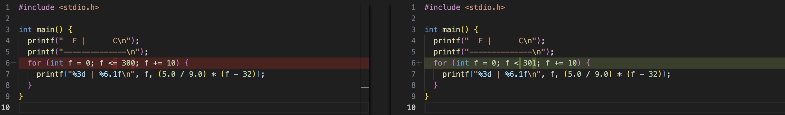
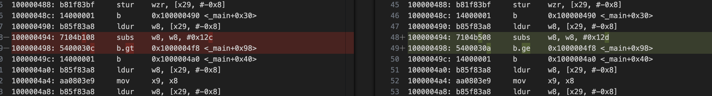

To run the Clojure code:

```
clojure src/chapter_1/fahrenheit_to_celsius.clj
```

To run the C code:

```
cc src/chapter_1/fahrenheit_to_celsius.c && ./a.out
```

To view the assembly from the C code:

```
objdump -s -d > src/chapter_1/fahrenheit_to_celsius.objdump
```

Idea: On save, build run objdump and compare the diff. We can use VS Code's git panel:




