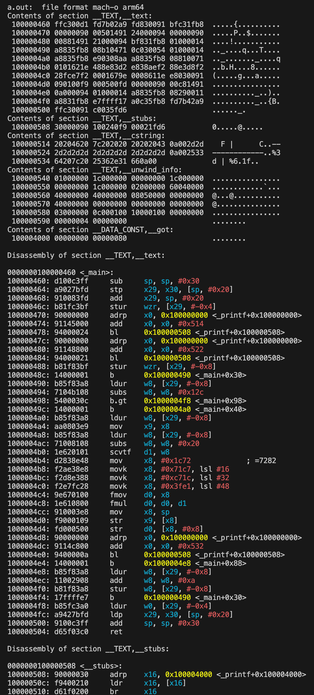

To run the Clojure code:

```
clojure src/chapter_1/fahrenheit_to_celsius.clj
```

To run the C code:

```
cc src/chapter_1/fahrenheit_to_celsius.c && ./a.out
```

To view the assembly from the C code:

```
objdump -s -d
```


